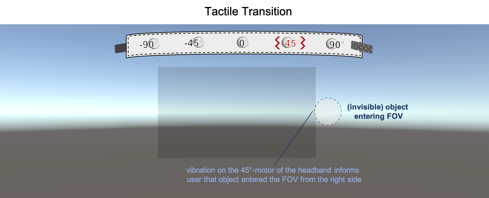

# Experiment description

 <!-- + This is just a brief introduction of the experiment. For a detailed explanation, see publication **Multisensory Proximity and Transition Cues for Improving TargetAwareness in Narrow Field of View Augmented Reality Displays**. + -->
In this experiment, we focus on augmented reality displays with a narrow field of view. The Microsoft HoloLens for example has a typically limited FOV of about 35° diagonally. Imagine that you have already much visual information displayed within the narrow FOV. How do you notice when a new, potentially very important information appears within the FOV next to all the existing information? It can easily happen that it is occluded by other visual information and the user does not notice it.
We want to investigate how to successfully inform the user that a new information of interest enters the FOV. We use a combination of different sensory cues (visual, auditory, vibration) to inform the user about when an information is approaching to the user and when it is entering the FOV. This experiment is - simply said - a reaction test if and when the user notices that an augmented information entered the FOV of the limited FOV HMD.

## Description of the Cues and Modes

The experiment uses three cue combination/modes which were determined in a user preference study in advance. Modes consist of proximity and transition cues in either visual, auditory, or vibrotactile form. The amount of modes as well as the desired cue combinations can be adjusted in the *PerformanceStudy.cs*-Script of the *Camera*-GameObject. Note that all elements of proximity and transition feedback will be fully randomized over all trials during the study.

To change the amount of training and/or performance trials, adjust the according value in the **PerformanceStudy.cs**-Script of the *Camera*-GameObject.

The three selected modes are described visually in an informal manner below. For further information, please refer to the IEEE TVCG Article [DOI: 10.1109/TVCG.2021.3116673](https://doi.org/10.1109/TVCG.2021.3116673).

### Mode 1 - Visual+Audio (VA)

### Mode 2 - Visual+Tactile (VT)

### Mode 3 - Audio+Tactile (AT)

## Awareness task
The task requires the user to react to an object that enters the FOV. The object can either approach from the left or the right side. The proximity cue tells the user from which side an object is approaching and provides information on the object’s distance to the field-of-view. 

To start/submit a Trial:
- Press 'A' button on the XboxOne controller
    - Alternative Keyboard input: Space key

As soon as the user notices that the invisible object enters the FOV (with the aid of the transition cue that is provided at that moment), he has to press a button on the XboxOne controller depending on the side on which the object enters:

- LB: The object entered the FOV from the left side
- RB: The object entered the FOV from the right side
    - Alternative Keyboard input: Left Arrow / Right Arrow

This is a reaction test, it is important that the user presses the corresponding button as quickly as possible after he has perceived the transition cue.

## Focal attention task
In addition to the awareness task, the participant has to solve a focal attention task:
In the center of the FOV a number sequence is shown continuously. The user has to press the A button on the XboxOne controller every time the number 7 is shown as quickly as possible (no matter if the invisible object is inside or outside the FOV). Both tasks are equally important, so the user should try to not concentrate on one task only but to solve both tasks (user task and secondary task) equally well.

- Alternative Keyboard input: 'A' key

## Experiment schedule
Each part of the experiment (condition 1 + condition 2) consists of two training phases and one performance phase. In the training phases, no values will be recorded. In these phases the user should get used to the system, modes and user tasks. However, the performance phase will record all user data and save them on the HoloLens storage. All training and performance repititions can be adjusted in the Unity editor.

### Training phase 1: 9 Trials
In training phase 1, the upcoming mode is always shown to the user before the next trial starts. Before each trial, the user should read and be aware about the upcoming mode. “Outer Feedback” relates to proximity and inner feedback relates to transition. When the user is ready, the A button of the controller needs to be pressed to play the training trial.

Furthermore, visual aids are shown to inform the user about the correctness of solving the user task. After pressing a button (LB or RB) on the XboxOne controller, a coloured line is shown that indicates the (1) path/direction of the object and (2) the correctness of the user input according to the following colours:

- **Red line** indicates that either the user pressed the button too late (left picture - object almost exits the FOV again) or too early (right picture - object did not enter the FOV yet).

- **Orange line** indicates that the user pressed the button at the correct time (object entered the FOV) but has chosen the wrong side (e.g. pressed LB instead of RB).

- **Green line** indicates that the user pressed the correct button at the correct time.

Furthermore, audio signals will be used for the secondary task (number reaction test) to indicate correct or incorrect button press. Whenever the user presses the button correctly when the number 7 is shown, a “super mario coin”-sound is played. Whenever the user missed to press the button or pressed the button when another number (not 7) was shown, a failure sound is played.

### Training phase 2: 15 Trials
The second training is supposed to prepare the participant for the main experiment. This phase will be identical to the upcoming performance phase but still no user data will be recorded. The user is not informed about the correctness about the user input anymore like in training phase 1. There will be no stops between trials, this phase will stop when all 15 trials are over.

### Performance phase: 150 Trials
This phase is the main experiment. As in training phase 2, the user has to react continuously to the approaching objects and the number reaction test. Here, all user data will be recorded.

