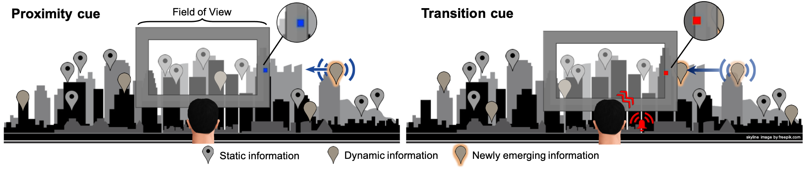

## 
Multisensory Proximity and Transition Cues for Improving Target Awareness in Narrow Field of View Augmented Reality Displays

*Augmented reality applications allow users to enrich their real surroundings with additional digital content. However, due to the limited field of view of augmented reality devices, it can sometimes be difficult to become aware of newly emerging information inside or outside the field of view. Typical visual conflicts like clutter and occlusion of augmentations occur and can be further aggravated especially in the context of dense information spaces. In this paper, we evaluate how multisensory cue combinations can improve the awareness for moving out-of-view objects in narrow field of view augmented reality displays. We distinguish between proximity and transition cues in either visual, auditory or tactile manner. Proximity cues are intended to enhance spatial awareness of approaching out-of-view objects while transition cues inform the user that the object just entered the field of view. In study 1, user preference was determined for 6 different cue combinations via forced-choice decisions. In study 2, the 3 most preferred modes were then evaluated with respect to performance and awareness measures in a divided attention reaction task. Both studies were conducted under varying noise levels. We show that on average the Visual-Tactile combination leads to 63\% and Audio-Tactile to 65\% faster reactions to incoming out-of-view augmentations than their Visual-Audio counterpart, indicating a high usefulness of tactile transition cues. We further show a detrimental effect of visual and audio noise on performance when feedback included visual proximity cues. Based on these results, we make recommendations to determine which cue combination is appropriate for which application.*

### Short description
We focus in our experiments on devices with a limited field of view, such as the Microsoft HoloLens. The basic idea of the experiment is to inform the user about objects that are currently not visible because they are appear outside the field-of-view (FOV) of the used device.  However, such information may enter the FOV at some point without the user noticing it. We have three modes to inform the user about an incoming object **and** that this object enters the FOV to increase awareness. Each mode uses a different combination of visual and non-visual sensory cues and is separated into two parts: 
1. Information about the **proximity** of the object (object that is approaching from left or right). 
2. Information that this object enters (**transition**) the FOV.

For a detailed explanation, please refer to the IEEE TVCG Article [(DOI: 10.1109/TVCG.2021.3116673)](https://doi.org/10.1109/TVCG.2021.3116673).

### Table of contents

The project is intended to work on the HTC Vive (Pro) and the Microsoft HoloLens (Gen1). Please refer to the according sections for the Setup instructions. For detailed experiment and User input instructions, please see the [Experiment and task description Section](Experiment.md).

- [Setup VR Environment](SetupVR.md)
- [Setup AR Environment](SetupAR.md)
- [Experiment and task description](Experiment.md)
- In case vibration cues should be involved:
  - [Setup Raspberry Pi](SetupRaspi.md)
  - [Setup vibration interface](VibrationSetup.md)

In case of any further questions or problems in the documentation, please contact alexander.marquardt@h-brs.de. 

### Trademarks
This project uses the Steam® Audio SDK. Steam® is a trademark or registered trademark of Valve Corporation in the United States of America and elsewhere

Steam® Audio, Copyright 2017 – 2021, Valve Corp. All rights reserved.
