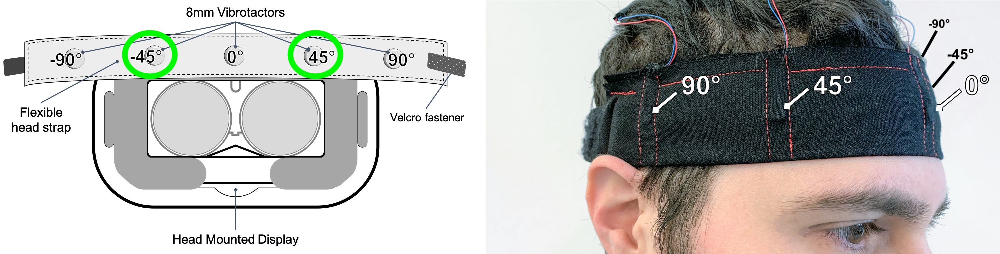
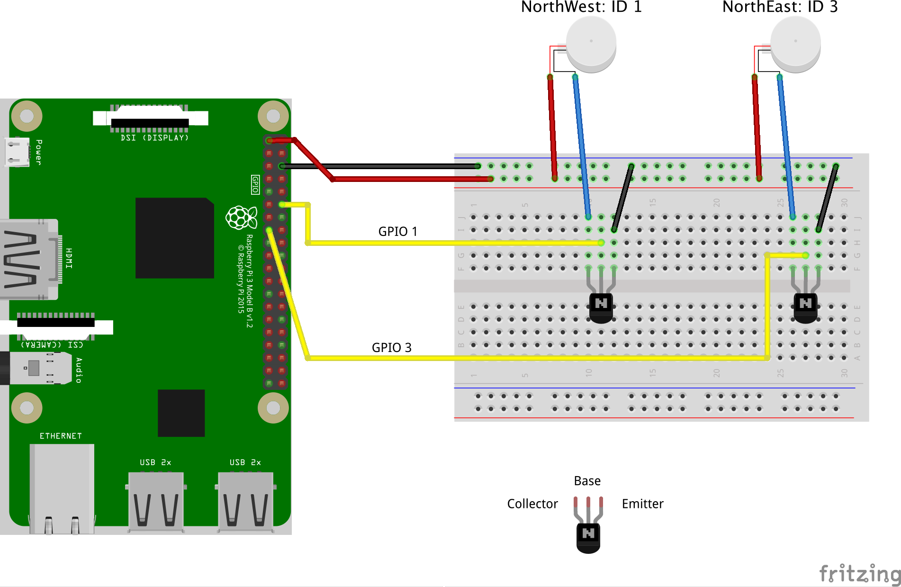
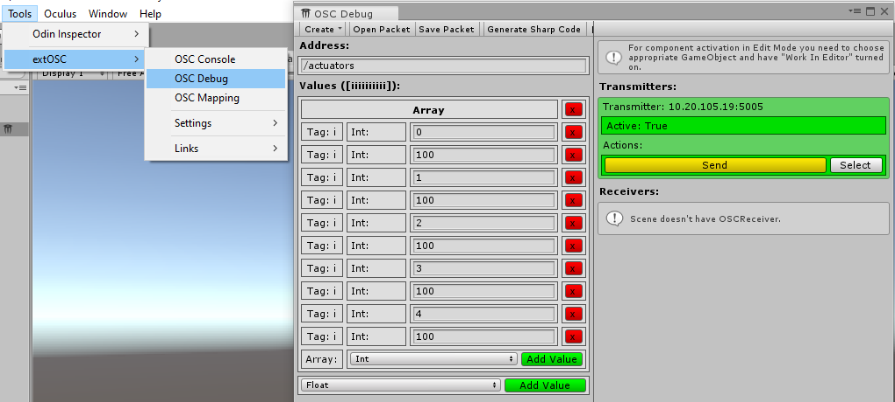

# Vibration Setup

Currently, two vibration motors (Precision Microdrives 308-107) are used for vibrotactile signals on the users forehead. The vibration motors are placed at -45° and 45° angle on a cotton fabric headband. 

<center></center>

The vibration motors were driven by a Raspberry Pi 3 Model B+ over network, running a Python-based version of Open Sound Control, see [Setup Raspberry Pi](SetupRaspi.md).

## Create Circuit

Please follow the circuit scheme to drive the vibration motors with a Raspberry Pi. We use NPN-transistors (such as 2N2222A) to power up the motors.

<center></center>

- Connect the red cable of the motor to the 3.3V power pin of Raspberry Pi
- Connect the other blue/black cable to the Collector of the transistor
- Connect the according GPIO/WiringPi Pin to the Base of the transistor 
- Finally, the Emitter needs to be grounded.

## Test OSC-Connection in Unity and drive motors

The connections can be tested in Unity with the OSC Debug Tool:

- Open a new Unity-Project and import "extOSC"-Asset from AssetStore. 
- Add "OSC Transmitter (Script)" from that Asset to any GameObject.
- In that script, enter the correct IP of the Raspberry Pi and Port *5005*
- Open the OSC-Debug window inside Unity 
  - ```Tools -> extOSC -> OSC Debug```
  - Select the GameObject with the containing "OSC Transmitter (Script)" in the Scene by pressing "Select".
  - Set "Address" to ```/actuators```

First add one array to "Values". Then add two int-values for each vibration motor of the head band. First vint-value describes the ID of the motor, the second int-value sets the strength of the vibration from 0 to 100.

The following IDs should control the corresponding motors:
- ID: 1 -> Northwest (-45°) motor
- ID 3 -> Northeast (45°) motor

Now you can send values (e.g. 100) to the IDs and check if the corresponding motors start vibrating.

